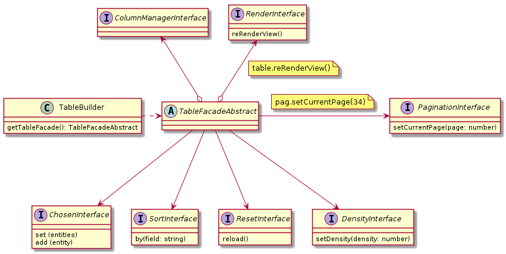

### Table building: 


See more about:
[TableBuilderInterface](./src/Facades/TableFacadeInterface.js),
[TableBuilderAbstract](./src/Facades/TableFacadeAbstract.js)
and
[TableBuilder](./src/Facades/TableFacade.js)

```javascript
const factory = new ColumnEntityFactory()
const columnManager = new ColumnManager((entity) => {
  return factory
    .addBody('id', entity.getID())
    .addBody('name', entity.getName())
    .getBodies()
}, (
  factory
    .addHeader('id',  '#ID')
    .addHeader('name', 'Name: ')
    .getHeaders()
))
const builder = new TableBuilder(() => {
    this.render()
  }, columnManager)
const table = builder.getTableFacade()

```
### Sorting: 
##### [Read more](./src/Models/Sort/readme.md)
```javascript
const tableSort = table.getSortManager()
tableSort.by('name')
const sortedEntities = table.getEntities(entities)
console.log(sortedEntities)
```

### Pagination: 

##### [Read more](./src/Models/Pagination/readme.md)
```javascript
const tablePag = table.getPaginationManager()
tablePag.first(entities)
tablePag.next(entities)
tablePag.prev(entities)
tablePag.latest(entities)
tablePag.setCurrentPage(2)
```

### Switch density:

##### [Read more](./src/Models/Density/readme.md)
```javascript
const tableDensity = table.getDensityManager()
tableDensity.setDensity(1)
tableDensity.setDensity(3)
tableDensity.setDensity(2)
```
### Choosing rows:

##### [Read more](./src/Models/Chosen/readme.md)
```javascript
const tableRowChoosing = table.getChooseManager()
tableRowChoosing.add(entities[1])
tableRowChoosing.add(entities[4])
const chosenEntities = tableRowChoosing.get()
console.log(chosenEntities)
```

### Reloadong:

##### [Read more](./src/Models/Reset/readme.md)
```javascript
table.getResetManager().reload()
```

### Rerendering: 

##### [Read more](./src/Models/Render/readme.md)
```javascript
table.getRenderManager().reRenderView()
```