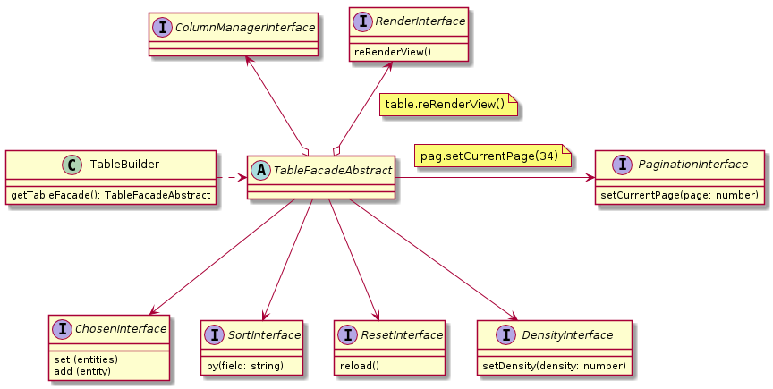

### Example:

```javascript
const columnManager = new ColumnManager((entity) => {
  return new ColumnEntityFactory()
    .addBody('id', entity.getID())
    .addBody('name', entity.getName())
    .getBodies()
}, (
  new ColumnEntityFactory()
    .addHeader('id',  '#ID')
    .addHeader('name', 'Name: ')
    .getHeaders()
))
const builder = new TableBuilder(() => {
    this.render()
  }, columnManager)
const table = builder.getTableFacade()

```
### See more about:
[TableBuilderInterface](./src/Facades/TableFacadeInterface.js),
[TableBuilderAbstract](./src/Facades/TableFacadeAbstract.js)
and
[TableBuilder](./src/Facades/TableFacade.js)




