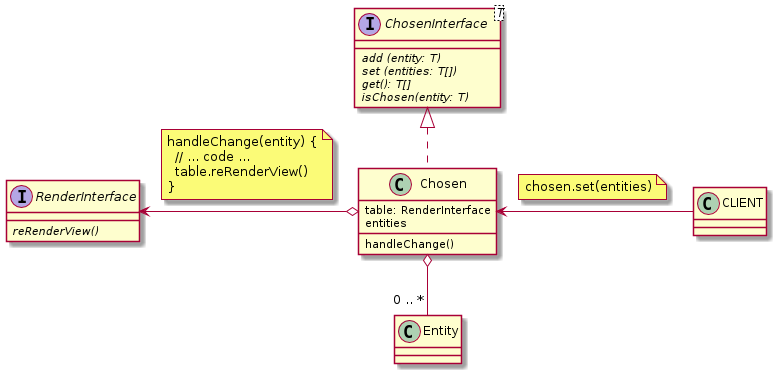

## [ChosenInterface](./ChosenInterface.js) and [Chosen](./Chosen.js)

### Methods:

| Name | Params | Return |
| --- | --- | --- |
| add | T | void |
| set | T[] | void |
| get | | T[] | 
| isChosen | T | Boolean | 

### ULM:

