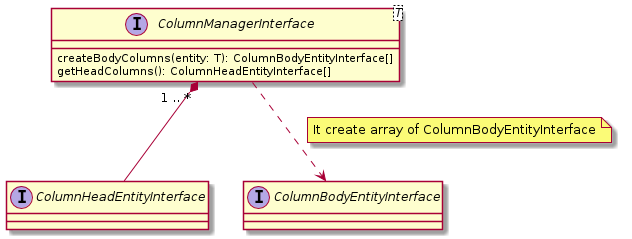

## [ColumnManagerInterface](./ColumnManagerInterface.js) and [ColumnManager](./ColumnManager.js)

### Methods:

| Name | Params | Return |
| --- | --- | --- |
| createBodyColumns | T | [ColumnBodyEntityInterface[]](../../Entities/BodyColumn/ColumnBodyEntityInterface.js) |
| getHeadColumns | | [ColumnHeadEntityInterface[]](../../Entities/HeadColumn/ColumnHeadEntityInterface.js) |

### UML

