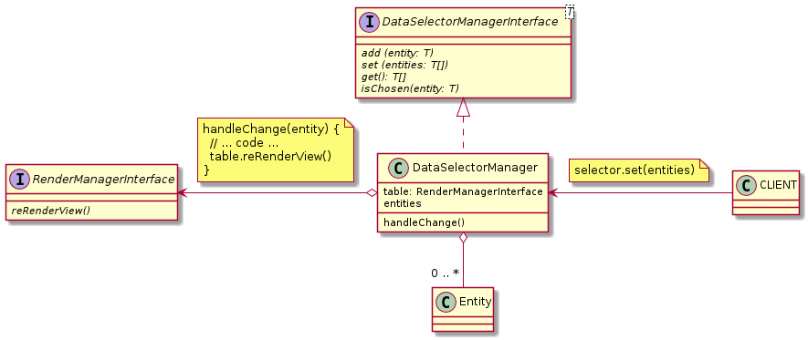

### Example:

```javascript
const tableRowChoosing = table.getChooseManager()
tableRowChoosing.add(entities[1])
tableRowChoosing.add(entities[4])
const chosenEntities = tableRowChoosing.get()
console.log(chosenEntities)
```

## [DataSelectorManagerInterface](DataSelectorManagerInterface.js) and [DataSelectorManager](DataSelectorManager.js)

### Methods:

| Name | Params | Return |
| --- | --- | --- |
| add | T | void |
| set | T[] | void |
| get | | T[] | 
| isChosen | T | Boolean | 



