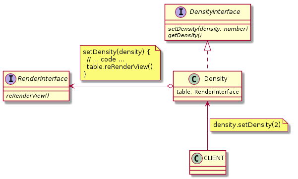

## [DensityInterface](./DensityInterface.js) and [Density](./Density.js)

### Methods:

| Name | Params | Return |
| --- | --- | --- |
| setDensity | Number | void |
| getDensity | --- | Number |

### ULM:

