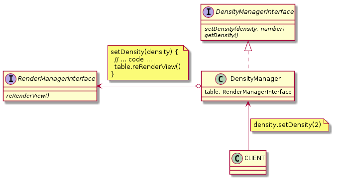

### Switch density:
```javascript
const tableDensity = table.getDensityManager()
tableDensity.setDensity(1)
tableDensity.setDensity(3)
tableDensity.setDensity(2)
```

## [DensityManagerInterface](DensityManagerInterface.js) and [DensityManager](DensityManager.js)

### Methods:

| Name | Params | Return |
| --- | --- | --- |
| setDensity | Number | void |
| getDensity | --- | Number |


