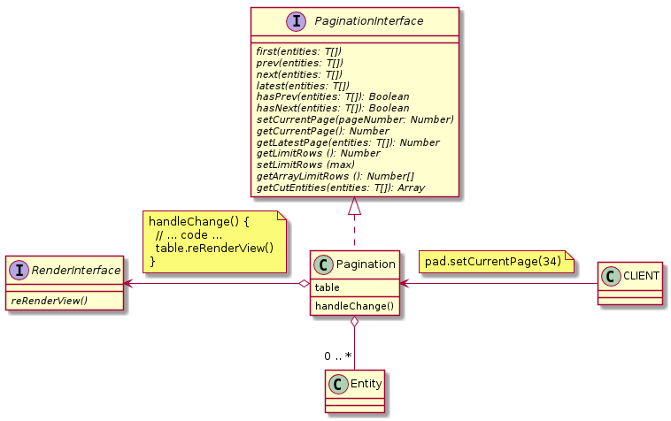

## [PaginationInterface](./PaginationInterface.js) and [Pagination](./Pagination.js)

### Methods:

| Name | Params | Return |
| --- | --- | --- |
| first | T[] | void |
| prev | T[] | void |
| next | T[] | void |
| latest | T[] | void |
| hasPrev | T[] | boolean |
| hasNext | T[] | boolean |
| setCurrentPage | number | void |
| getCurrentPage | --- | number |
| getLatestPage | T[] | number |
| getLimitRows | --- | number |
| setLimitRows | number | void |
| getArrayLimitRows | --- | number[] |
| getEntities | T[] | T[] |

### ULM:

