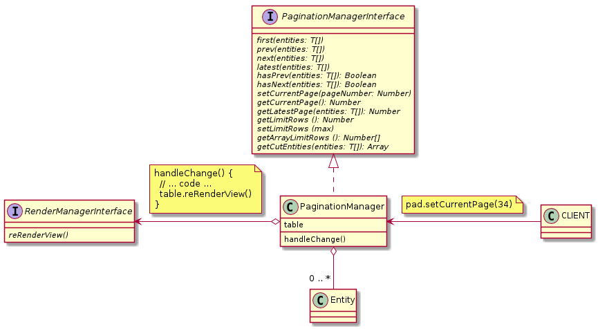

### PaginationManager: 

```javascript
const tablePag = table.getPaginationManager()
tablePag.first(entities)
tablePag.next(entities)
tablePag.prev(entities)
tablePag.latest(entities)
tablePag.setCurrentPage(2)
```

## [PaginationManagerInterface](PaginationManagerInterface.js) and [PaginationManager](PaginationManager.js)

### Methods:

| Name | Params | Return |
| --- | --- | --- |
| first | T[] | void |
| prev | T[] | void |
| next | T[] | void |
| latest | T[] | void |
| hasPrev | T[] | boolean |
| hasNext | T[] | boolean |
| setCurrentPage | number | void |
| getCurrentPage | --- | number |
| getLatestPage | T[] | number |
| getLimitRows | --- | number |
| setLimitRows | number | void |
| getArrayLimitRows | --- | number[] |
| getEntities | T[] | T[] |



