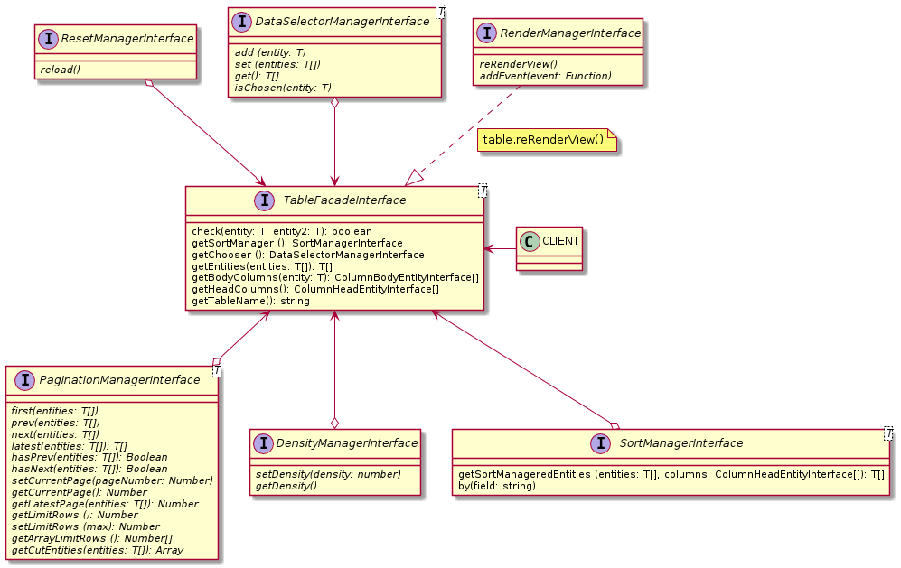

## Example: 
```javascript
table.getRenderManager().reRenderView()
```

## [RenderManagerInterface](RenderManagerInterface.js)

### Methods:

| Name | Params | Return |
| --- | --- | --- |
| reRenderView |  |  |



