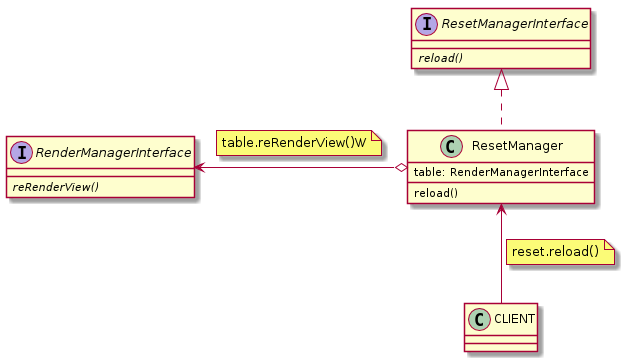

## Example:
```javascript
table.getResetManager().reload()
```

## [ResetManagerInterface](ResetManagerInterface.js) and [ResetManager](ResetManager.js)

### Methods:

| Name | Params | Return |
| --- | --- | --- |
| reload |  |  |



