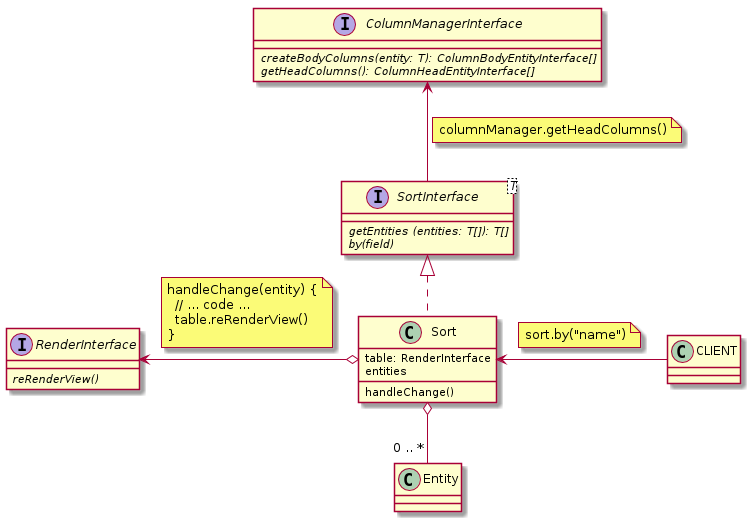

## [ResetInterface](./ResetInterface.js) and [Reset](./Reset.js)

### Methods:

| Name | Params | Return | Description |
| --- | --- | --- | --- |
| getEntities | T[]  | T[] | It returns sorted entities |
| by | string | void | You need input string like [ColumnHeadEntityInterface::getFieldName()](../../Entities/HeadColumn/ColumnHeadEntityInterface.js) |

### ULM:

