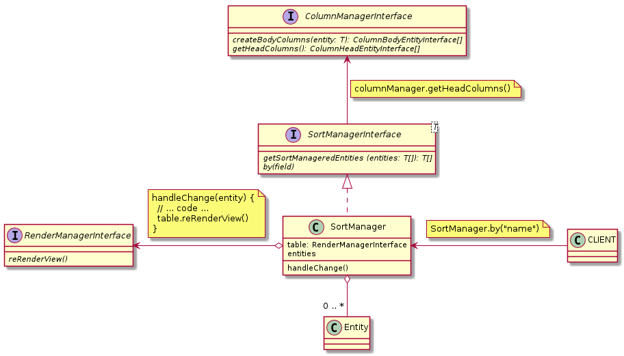

### Sorting: 
```javascript
const tableSort = table.getSortManager()
tableSort.by('name') // DESC
tableSort.by('name') // ASC
tableSort.by('name') // DESC
tableSort.by('name', TABLE_SORT_ASC)
tableSort.by('name', TABLE_SORT_DESC)
const sortedEntities = table.getEntities(entities)
console.log(sortedEntities)
```

## [SortManagerInterface](./SortManagerInterface.js) and [SortManager](./SortManager.js)

### Methods:

| Name | Params | Return | Description |
| --- | --- | --- | --- |
| getSortedEntities | T[]  | T[] | It returns sorted entities |
| by | string | void | You need input string like [ColumnHeadEntityInterface::getFieldName()](../../Entities/HeadColumn/ColumnHeadEntityInterface.js) |




